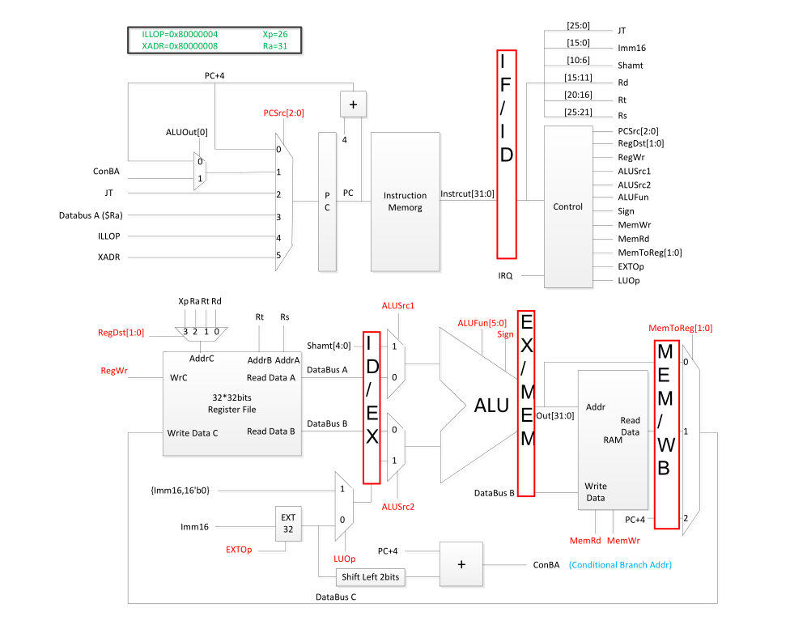

% 多周期处理器实验报告
% 庄永文 2013011208；郑奕辰 
% 2015.7

## 多周期处理器

### 实验目的
在单周期 MIPS  处理器的基础上，设计一个 5  级流水线的 MIPS  处理器。

### 设计方案

多周期处理器使用的UART、ALU等模块与单周期使用的相同。最大的区别是多周期的数据通路中间加了几级寄存器来实现多周期处理。

#### 整体设计：整体使用与教材《计算机组成与设计——硬件/软件接口》书中完全类似的设计，具体原理图如下，注意图中并没有画出转发冒险检测单元和中断处理的详细内容：


在试验中将整个设计整体划分为四部分

* 各级之间流水线寄存器设计
* 冒险检测与转发设计
* 单周期代码的改写
* 中断处理设计

下面分别介绍各个部分的设计。

#### 各级之间流水线寄存器设计

级间寄存器主要就是各种锁存器。包括`IF.v` `IF2ID.v` `ID2EX.v` `EX2MEM.v` `MEM2WB.v` 等模块，基本上每个模块都是一个有`rst`和`clk`信号的锁存器，前面几个模块还会有`flush`输入信号用于阻塞和中断。

#### 冒险检测与转发设计
<!-- ///还没有写呢 -->

#### 单周期代码改写
单周期代码改写主要改的就是把单周期分五个阶段每个阶段的输入输出接上级间寄存器，同时增加一些多路选择器用于冒险检测、转发和中断处理。

#### 中断处理设计

我们的中断处理是在`ID`取指令阶段触发的，也就是说，保存到26号寄存器的PC值是运行到`ID`阶段的指令的PC值。因为如果直接写26号寄存器的话极有可能在写这个寄存器时另外的指令在`WB`阶段也要写寄存器，而这时无法避免同时无法解决的。因此我们的解决方案是在触发中断时将`ID`阶段取到的指令强行替换成`addi $26,$0,PC`这样的指令。然后再把所有级间寄存器的`flush`信号强行置零，同时关闭所有的转发(因为已经不需要进行转发了)。具体原理图如下
<!-- ///这里要有原理图 -->

### 关键代码

#### 级间寄存器
级间寄存器应该说是最简单的一部分，只要明白有哪些信号是上一阶段产生的需要传递下去的或者是下一阶段需要用到哪些信号就可以了。例如

``` {.verilog .numberLines}
/*
Filename : IF.v
Compiler : Quartus II
Description : PC to PC register
INPUT : clk, rst, EN : all active high
        PCIn : 32bits Register
OUTPUT : PCIn : 32bits Register
Author : Yeoman Zhuang
Release : *
*/

module IF(
    input clk, rst, flush,
    input [31:0] PC_In,
    input [2:0] PCSrc, 
    input PCWrite, 
        Branch, 
    input [31:0] ConBA, 
        DataBusA, 
    input [25:0] JT, 
    output reg [31:0] PC_Out
);
    always @(posedge clk or posedge rst) begin
        if (rst) begin
            PC_Out <= 0;
        end else if(flush)
            PC_Out <= {PC_Out[31], {31{1'b0}}};
        else if (PCWrite) begin
            if(Branch) begin
                PC_Out <= ConBA;
            end else case (PCSrc)                //谁的PCSrc？
                3'h0: PC_Out <= PC_In+32'h4; //PC_In = PC
                3'h1: PC_Out <= PC_In+32'h4;
                3'h2: PC_Out <= {PC_In[31:28], JT, 2'b0};
                3'h3: PC_Out <= DataBusA; // jr jalr $Ra
                3'h4: PC_Out <= 32'h8000_0004; // ILLOP
                3'h5: PC_Out <= 32'h8000_0008; // XADR
                default: PC_Out <= 32'h8000_0008;
            endcase
        end else
            PC_Out <= PC_Out; 
        end
endmodule
```

``` {.verilog .numberLines}
/*
Filename : IF2ID.v
Compiler : Quartus II
Description : IF to ID register
INPUT : clk, rst, EN : all active high
        PCIn, InstructionIn : 32bits Register
OUTPUT : PCIn, InstructionOut : 32bits Register
Author : Yeoman Zhuang
Release : *
*/

module IF2ID(
    input clk, rst, flush, EN, 
    input [31:0]PCIn, InstructionIn, 
    output reg [31:0] PCOut, InstructionOut
);
    
    always @(posedge clk or posedge rst) begin
        if (rst) begin
            // reset
            PCOut<=32'h8000_0000;
            InstructionOut<=0;
        end else if(flush) begin
            PCOut <= {PCOut[31], {31{1'b0}}};
            InstructionOut<=32'h0;
        end else if(EN) begin
            PCOut<=PCIn;
            InstructionOut<=InstructionIn;
        end else begin
            PCOut<=PCOut;
            InstructionOut<=InstructionOut;
        end
    end

endmodule
```

其他级间寄存器也与上面两个基本类似，只是输入输出有所变化，下面只贴输入输出部分：

``` {.verilog .numberLines}
/*
Filename : ID2EX.v
Compiler : Quartus II
Description : ID to EX register
INPUT : clk, rst, EN, all acitve high
        AluSrc1_In, AluSrc2_In, RegWrite_In, Branch_In, MemWrite_In, MemRead_In, 
        [31:0] PC_In, DataBusA_In, DataBusB_In, Imm_In,
        [4:0] Rd_In, Rt_In, Shamt_In
        [5:0] ALUFun_In, 
        [3:0] PCSrc_In, 
        [1:0] RegDst_In, MemtoReg_In, 
OUTPUT : AluSrc1_Out, AluSrc2_Out, RegWrite_Out, Branch_Out, MemWrite_Out, MemRead_Out, 
        [31:0] PC_Out, DataBusA_Out, DataBusB_Out, Imm_Out,
        [4:0] Rd_Out, Rt_Out, Shamt_Out
        [5:0] ALUFun_Out, 
        [3:0] PCSrc_Out, 
        [1:0] RegDst_Out, MemtoReg_Out, 
Author : Yeoman Zhuang
Release : *
*/
```

``` {.verilog .numberLines}
/*
Filename : EX2MEM.v
Compiler : Quartus II
Description : EX to MEM register
INPUT : clk, rst, EN, all active high
        RegWrite_In, MemWrite_In, MemRead_In, 
        [31:0] PC_In, ALUOut_In, DataBusB_In
        [4:0] AddrC_In, 
        [3:0] PCSrc_In, 
        [1:0] MemtoReg_In, 
OUTPUT : RegWrite_Out, MemWrite_Out, MemRead_Out, 
        [31:0] PC_Out, ALUOut_Out, DataBusB_In
        [4:0] AddrC_Out, 
        [3:0] PCSrc_Out, 
        [1:0] MemtoReg_Out, 
Author : Yeoman Zhuang
Release : *
*/
```

``` {.verilog .numberLines}
/*
Filename : MEM2WB.v
Compiler : Quartus II
Description : MEM to WB register
INPUT : clk, rst, EN, all active high
        [31:0] PC_In, ALUOut_In, rdata_In, 
        [4:0] AddrC_In, 
        [1:0] MemtoReg_In, 
OUTPUT : RegWrite_Out
        [31:0] PC_Out, ALUOut_Out, rdata_Out, 
        [4:0] AddrC_Out, 
        [1:0] MemtoReg_Out, 
Author : Yeoman Zhuang
Release : *
*/
```

#### 冒险检测与转发设计 
<!-- ///这里不知道该怎么写 -->
冒险检测和转发两个模块在一个文件里，代码如下

``` {.verilog .numberLines}
module Forward(
    input EX2MEM_RegWrite, 
    input MEM2WB_RegWrite, 
    input [4:0] EX2MEM_Rd,     // !!! AddrC i.e. EX2MEM_Rd
            MEM2WB_Rd,     // !!! AddrC i.e. MEM2WB_Rd
            ID2EX_Rs, 
            IF2ID_Rs, 
            ID2EX_Rt, 
            IF2ID_Rt, 
            ID2EX_Rd, 
    output reg[1:0] ForwardA,
        ForwardB, 
    output reg ForwardC, 
        ForwardD
);
    // ForwardX: 2->ALUOut, 1->wdata, 0->DataBusA
    //           2->last, 1->last last, 0->normal
    always @(*) begin
        if((EX2MEM_RegWrite)&&(EX2MEM_Rd!=5'h0)&&(EX2MEM_Rd==ID2EX_Rs))
            ForwardA <= 2'h2;
        else if( (MEM2WB_RegWrite) & (|MEM2WB_Rd) & (MEM2WB_Rd==ID2EX_Rs) & ~(EX2MEM_Rd==ID2EX_Rs&&EX2MEM_RegWrite))
            ForwardA <= 2'h1;
        else
            ForwardA <= 2'h0;
    end

    always @(*) begin
        if((EX2MEM_RegWrite)&(|EX2MEM_Rd)&(EX2MEM_Rd==ID2EX_Rt))
            ForwardB <= 2'h2;
        else if((MEM2WB_RegWrite) & (|MEM2WB_Rd) & (MEM2WB_Rd==ID2EX_Rt) & ~(EX2MEM_Rd==ID2EX_Rt&&EX2MEM_RegWrite)  )
            ForwardB <= 2'h1;
        else
            ForwardB <= 2'h0;
    end

    always @ (*)
        if(MEM2WB_RegWrite & (|MEM2WB_Rd) & (MEM2WB_Rd == IF2ID_Rs)) // Rd ie AddrC to be written
            ForwardC = 1'b1;
        else
            ForwardC = 1'b0;

    always @ (*)
        if(MEM2WB_RegWrite & (|MEM2WB_Rd) & (MEM2WB_Rd == IF2ID_Rt)) // Rd ie AddrC to be written
            ForwardD = 1'b1;
        else
            ForwardD = 1'b0;
endmodule

// no IF2ID_Rs & IF2ID_Rt
// directly connect from `instruction` outside this module
//为产生气泡，对寄存器进行清除，产生气泡可以延后时钟周期方便转发
//jump为第二阶段，branch为第三阶段，清除寄存器延后时钟周期
module Hazard(
    input ID2EX_MemRead, 
        Branch, 
        Jump, 
    input[4:0] ID2EX_Rt, 
        IF2ID_Rs, 
        IF2ID_Rt, 
    output reg PCWrite, 
        IF2ID_flush, 
        IF2ID_write,
        ID2EX_flush
);
    //
    always @(*) begin
        if(ID2EX_MemRead&((ID2EX_Rt==IF2ID_Rs)|(ID2EX_Rt==IF2ID_Rt))) begin
            PCWrite = 1'b0;
            IF2ID_flush = 1'b0;
            IF2ID_write = 1'b0;
            ID2EX_flush = 1'b1;
        end else if(Jump) begin
            PCWrite = 1'b1;
            IF2ID_flush = 1'b1;
            IF2ID_write = 1'b0;
            ID2EX_flush = 1'b0;
        end else if(Branch) begin 
            PCWrite = 1'b1;
            IF2ID_flush = 1'b1;
            IF2ID_write = 1'b0;
            ID2EX_flush = 1'b1;
        end else begin
            PCWrite = 1'b1;
            IF2ID_flush = 1'b0;
            IF2ID_write = 1'b1;
            ID2EX_flush = 1'b0;
        end
    end
 endmodule
```

#### 单周期代码改写 
这里的改动比较琐碎，而且几乎都是定义wire型的信号然后把原来单周期里直接连起来的部分中间加上一层级间寄存器而已，具体代码都在`CPU.v`里，这里就不贴了。

#### 中断处理 
中断处理的设计是最琐碎的，也是写在了`CPU.v`里，关键代码如下

1. 将中断信号转换为一个脉冲。这里因为我们的设计是让把中断变成一个`addi $26 $0 PC`的指令，中断信号是直接接入指令译码模块的，因此如果中断信号不是一个高电平脉冲的话，那么就会一直写26号寄存器。本来我们认为`~PC[31]&IRQ`就可以起到这种作用的，但是后来发现这样容易出BUG，因此干脆就强行把中断信号变成一个高电平脉冲了。
``` {.verilog .numberLines}
always @ (posedge clk)
        IRQ__ = IRQ; //& ~IF2ID_flush
assign IRQ_ = ~IRQ__ & IRQ;
```

2. 中断时禁止其他一切阻塞转发信号。

``` {.verilog .numberLines}
assign Branch_ = ~IRQ_ & Branch;//中断的时候禁止跳转
assign irq_ID2EX_flush = ~IRQ_ & ID2EX_flush;
assign irq_IF2ID_flush = ~IRQ_ & IF2ID_flush;//中断时禁止阻塞
// 防止出现转发将中断时所有寄存器地址变为0
assign ID2EX_Rd_In = IRQ_ ? 5'h0 : IF2ID_InstructionOut[15:11];
assign ID2EX_Rt_In = IRQ_ ? 5'h0 : IF2ID_InstructionOut[20:16];
assign ID2EX_Rs_In = IRQ_ ? 5'h0 : IF2ID_InstructionOut[25:21];
// 这里是强行修改指令的部分，如果中断产生那么DataBusA就是$0,
// 而DataBusB就是PC(当前PC或者前一条beq指令跳转的PC(ConBA))
assign ID2EX_DataBusA_In = (IRQ_ & ~IF2ID_PCOut[31]) ? 32'b0 : 
    ForwardC ? wdata : 
    rdata1;
assign ID2EX_DataBusB_In = (IRQ_ & ~IF2ID_PCOut[31]) ? (Branch ? ConBA : ID2EX_PC_In) : 
    ForwardD ? wdata : 
    rdata2;
```

### 文件清单
- CPU.v 顶层模块
    + IF.v, IF2ID.v, ID2EX.v, EX2MEM.v, MEM2WB.v 级间寄存器
    + Forward_Hazard.v 冒险检测和转发模块
    + Instruction.v 指令存储器
    + Register.v 寄存器
    + Control.v 控制模块
    + ALU.v 算术逻辑单元
    + DataMem.v 数据存储器
        * UART.v 异步串口收发


### 仿真结果及分析

<!-- ///这里要有仿真结果 -->

### 综合情况

<!-- ///这里要有综合情况 -->

### 硬件调试情况
* 调试好单周期的CPU以后，流水线的基本部分就会简单很多，一开始发现转发冒险部分有一点问题，就是该条指令后第1、2条指令会转发，第4、5条指令不会被影响，但是第三条指令会出现寄存器边读边存的情况，课件上也只是语焉不详地写着可以依靠实现解决，然而我们想了很久没有搞明白怎么解决，反而差点觉得寄存器不应该是时序的而把自己搞晕。因此最后解决方案就是再加一层Forward。
* 在中断处理部分，我们本来想的是如课本上一样，做一个额外的中断存储寄存器，而实验指导书要求是放到26号寄存器里，这样存储中断处PC的时候极有可能另一个WriteBack阶段的命令也在写寄存器，这样就造成了冲突，而且这个冲突是没办法用类似转发的方式解决的。于是我们把26号寄存器做成一个特殊的可以单独读写的寄存器，但是这样编译的时候有几百个warning。于是我们用了现在的解决方案。
* 使用强行写指令的方式保存中断PC的方法，仿真的时候遇到了很多问题，比如26号寄存器会不断变化，于是把中断信号处理成了一个脉冲；然后26号寄存器的值写成了0，这是因为中断时正在气泡中，PC被flush掉了，因此中断信号要禁止flush；然后26号寄存器值还是不对，这次就是因为存入的值在DataBus那里被转发的值取代了，因此让中断信号禁止转发；然后还是有bug，这次是因为beq指令判中了以后ID阶段的PC值应该是ConBA的值，因此这一条又要加上。最终我们终于搞清楚中断的概念了，就是中断的优先级是最高的，当中断信号到来的时候，任何其他信号都要为中断信号让位。


### 思想体会
* 一定要在写代码的时候，甚至是写代码之前的时候，就把一切的流程都想清楚，这样才能有条不紊。本次实验中中断处理应该是最麻烦也最难的环节了。在把冒险检测、转发设计、级间寄存器以及改写单周期代码都完成以后，很快就可以正常工作了，但是加上了中断以后问题就变得多了起来，通过不断仿真发现了各种始料未及的BUG，最后在这里也浪费了很多时间，一切都是因为一开始没有考虑周详。
* 在分好任务以后要经常沟通甚至像是最后的流水线应该是一起开发，这样互相讨论效率也会更高。
* 不要熬夜，虽然我们最后一天也是为了中断熬了个夜，但是之前都是按时作息的，这样效率更高。
