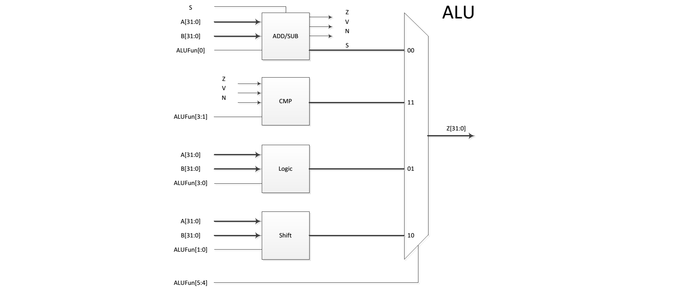
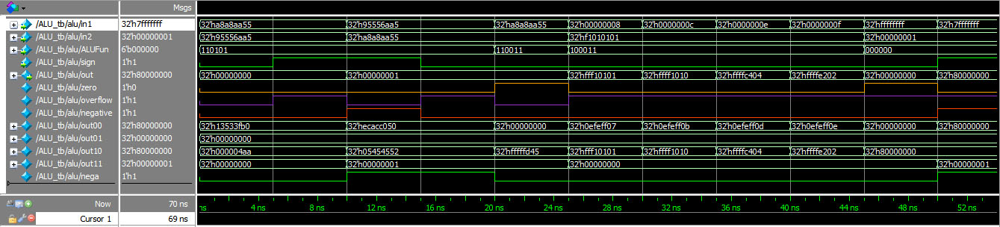
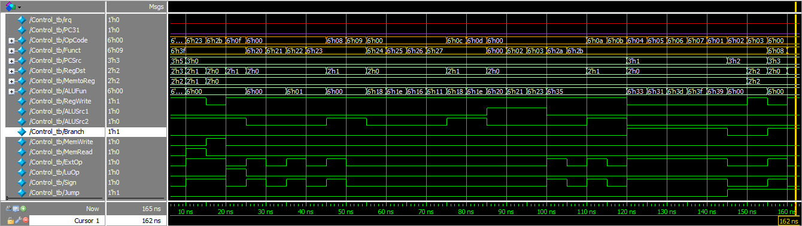
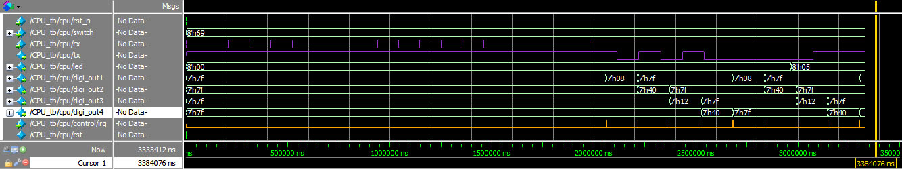

% 32位MIPS处理器设计
% 庄永文&nbsp;; 郑奕辰&nbsp;; 张传奕
% 2015.7

67.28MHz
[_Github链接_](https://github.com/zYeoman/32BIT-MIPS-CPU)
<!-- pandoc test.md \-\-listings -H listings-setup.tex -o output.pdf -->

##32位ALU (张传奕)

###设计方案

无论何时都执行加法，得到的溢出`V`，负号`N`和零`Z`信号输入比较模块。比较模块根据操作数、是否是符号运算和上述信号判断结果。



加法器模块若是加法就将两操作数相加，若是减法则与第二个操作数的补码相加。得到的结果输出为`out00`，`Z V N`送入比较子模块。

- 结果是零，那么`Z`自然是零
- 如果是无符号运算，则`N`永远不会是负数，有符号时若最高位是`1`则为负数
- 如果是无符号加法，则当计算结果比较大输入小时发生溢出，减法则是结果比较小输入大时溢出；如果是有符号运算，当跨越数轮正负分界线时发生溢出，也就是计算前后最高位变化时溢出。这里因为使用了本身自带的加法，让软件综合加法器加快速度，所以无法使用进位不同的办法来检测溢出。

比较模块根据`N, V, Z`判断真假输出。语句比较浅显，需要指出的是`bgez`和`bgtz`本身的`in2`是不能用的，因为`$1, $11`寄存器中的数值并不能作为0或者1用于计算，结果通常是错的，所以仅使用了第一个操作数。这里并不是很清楚Hennesy教授他们在设计MIPS架构时为何要使用这样的奇怪数值。

逻辑模块对输入进行与或非等操作。移位模块使用了5个级联的移位器，模仿桶形移位器结构。

最后

``` {.verilog .numberLines}
assign negative = sign&nega;

always @ (*) begin
    case (ALUFun[0])
        1'b0: begin
            out00 = in1 + in2;
            zero = (out00 == 1'b0)? 1'b1 : 1'b0;
            overflow = sign ? (out00[31]^in1[31])&(out00[31]^in2[31]) : 
                    out00 < in1 || out00 < in2;
            nega = out00[31];
        end
        1'b1: begin
            out00 = in1 + ~in2 + 32'b1;
            zero = (out00 == 1'b0)? 1'b1 : 1'b0;
            overflow = sign ? (out00[31]^in1[31])&(out00[31]^in2[31]) : 
                    out00 > in1 || out00 > in2;
            nega = out00[31];
        end
        default : out00 = 32'b0;
    endcase
```
``` {.verilog .numberLines}
    case (ALUFun[3:1])
        3'b001: out11 = zero ? 32'b1 : 32'b0;
        3'b000: out11 = zero ? 32'b0 : 32'b1;
        3'b010: out11 = nega ? 32'b1 : 32'b0;
        3'b110: out11 = (nega|zero) ? 32'b1 : 32'b0; // blez
        3'b100: out11 = (~in1[31]) ? 32'b1 : 32'b0; // bgez
        3'b111: out11 = (~in1[31]&~zero) ? 32'b1 : 32'b0; // bgtz
        default : out11 = 32'b0;
    endcase
```
``` {.verilog .numberLines}
    case (ALUFun[3:0])
        4'b1000: out01 = in1 & in2;
        4'b1110: out01 = in1 | in2;
        4'b0110: out01 = in1 ^ in2;
        4'b0001: out01 = ~(in1 | in2);
        4'b1010: out01 = in1;
        default : out01 = 32'b0;
    endcase
```
``` {.verilog .numberLines}
    case (ALUFun[1:0])
        2'b00: begin                            // sll
                    out10 = in2;
                    if (in1[4]) out10 = out10<<16;
                    if (in1[3]) out10 = out10<<8;
                    if (in1[2]) out10 = out10<<4;
                    if (in1[1]) out10 = out10<<2;
                    if (in1[0]) out10 = out10<<1;
                end
        2'b01: begin                            // srl
                    out10 = in2;
                    if (in1[4]) out10 = out10>>16;
                    if (in1[3]) out10 = out10>>8;
                    if (in1[2]) out10 = out10>>4;
                    if (in1[1]) out10 = out10>>2;
                    if (in1[0]) out10 = out10>>1;
                end
        2'b11: begin                            // sra
                    out10 = in2;
                    if (in1[4]) out10 = (out10>>16) | {{16{in2[31]}},{16{1'b0}}};
                    if (in1[3]) out10 = ((out10>>8) | {{8{in2[31]}},{24{1'b0}}});
                    if (in1[2]) out10 = (out10>>4) | {{4{in2[31]}},{28{1'b0}}};
                    if (in1[1]) out10 = (out10>>2) | {{2{in2[31]}},{30{1'b0}}};
                    if (in1[0]) out10 = (out10>>1) | {{1{in2[31]}},{31{1'b0}}};
                end
        default : out10 = 32'b0;
    endcase
```
``` {.verilog .numberLines}
    case(ALUFun[5:4])
        2'b00: out = out00;
        2'b01: out = out01;
        2'b10: out = out10;
        2'b11: out = out11;
        default: out<= 32'b0;
    endcase
```
###测试结果



###小结

制作ALU部分较为简单，只是将各种运算按照标准搬上去就可以用了。在涉及到溢出的部分我又回去看了一下书，最后才想到的这种实现方法，而之所以之前一直使用的一种不正确的溢出检测并没有出现问题，是因为我们并没有实现溢出异常检测，也没有用到该信号。


##单周期处理器 (张传奕)##

###设计方案###

####指令存储器 `InstuctionMem.v`####

该模块是一个组合逻辑构成的ROM，输入地址`addr[31:0]`，输出指令`instruction[31:0]`。该模块使用电平敏感的`always`块描述组合逻辑。直接将指令通过`case`的方式储存起来，便于查找。设计的上限是128条指令，后面实践证明也的确够用了。
``` {.verilog .numberLines}
parameter ROM_SIZE = 128;
parameter ROM_BIT  = 7;  // 2^7 = 128

always @ (*)
    case (addr[ROM_BIT+1:2])
        7'd0: instruction = 32'h08000003;
        ...
    endcase
end
```

####寄存器 `Register.v`####

寄存器堆有31个32位深寄存器，其中零号寄存器没有必要设置因为不能写而且永远读出0。读电路是组合电路，异步变化；写电路是时序电路，仅在复位或时钟上升沿时写，`$zero`的写入操作自动忽略。
``` {.verilog .numberLines}
reg [31:0] Reg[31:1]; // 32 registers
integer i;

assign rdata1 = (r1==5'b0) ? 32'b0 : Reg[r1]; // $zero always 0
assign rdata2 = (r2==5'b0) ? 32'b0 : Reg[r2];

always @ (posedge clk or posedge rst) begin
    if (rst)                               // posedge rst
        for(i=1;i<32;i=i+1) Reg[i]<=32'b0;  // clear regs
    else if ( RegWrite && ~(w==5'b0) )      // posedge clk
            Reg[w] <= wdata;
end
```

####控制模块`Control.v`####

控制模块较为复杂，根据`OpCode`和`Funct`产生各个控制信号。只要根据下面的这张表手动构造真值就可以了，这个简化工作是纯手动的，没有写成原始的真值由软件综合，原因是可综合的文件不应该包含`x`，而自己分配的值又不一定是最优的，还不如手动写逻辑。
当时我还不清楚用于线网变量的`assign`和用于寄存器变量的`always @ (*)`电平敏感描述方法是否相同，写完后发现发现两者几乎是等价的，参考书上也提到了这点。而一开始我按照Patterson & Hennesey 书上的架构加入了一个独立的`ALU Control`单元，后来我也将这一功能并入`Control`模块，并且是用`always @ (*)`块写的。
控制信号真值表如下：

----------------------------------------------------------------------------------
指令  PCsrc RegDst RegWrite ALUsrc1 ALUsrc2 ALUFun Sign MemWr MemRe M2R ExtOp LuOp
----- ----- ------ -------- ------- ------- ------ ---- ----- ----- --- ----- ----
lw      0     1        1       0       1     add     1    0     1    1    1   0

sw      0     x        0       0       1     add     1    1     0    x    1   0

lui     0     1        1       0       1     add     0    0     0    0    0   1

addi    0     0        1       0       0     add     1    0     0    0    x   0

addu    0     0        1       0       0     add     0    0     0    0    x   0

sub     0     0        1       0       0     sub     1    0     0    0    x   0

subu    0     0        1       0       0     sub     0    0     0    0    x   0

addi    0     1        1       0       1     add     1    0     0    0    1   0

addiu   0     1        1       0       1     add     0    0     0    0    0   0

and     0     0        1       0       0     and     x    0     0    0    x   0

or      0     0        1       0       0     or      x    0     0    0    x   0

xor     0     0        1       0       0     xor     x    0     0    0    x   0

nor     0     0        1       0       0     nor     x    0     0    0    x   0

andi    0     1        1       0       1     and     x    0     0    0    0   0

ori     0     1        1       0       1     or      x    0     0    0    0   0

sll     0     0        1       1       0     ll      x    0     0    0    x   0

srl     0     0        1       1       0     rl      x    0     0    0    x   0

sra     0     0        1       1       0     ra      x    0     0    0    x   0

slt     0     0        1       0       0     lt      1    0     0    0    x   0

sltu    0     0        1       0       0     lt      0    0     0    0    x   0

slti    0     1        1       0       1     lt      1    0     0    0    1   0

sltiu   0     1        1       0       1     lt      0    0     0    0    0   0

beq     1     x        0       0       0     eq      1    0     0    x    1   0

bne     1     x        0       0       0     ne      1    0     0    x    1   x

blez    1     x        0       0       0     lez     1    0     0    x    1   x

bgtz    1     x        0       0       0     gtz     1    0     0    x    1   x

bgez    1     x        0       0       x     egz     1    0     0    x    1   x

j       2     x        0       x       x     add     0    0     0    x    x   0

jal     2     2        1       x       x     add     0    0     0    2    x   0

jr      3     x        0       x       x     add     1    0     0    x    x   x

jalr    3     2        1       x       x     add     0    0     0    2    x   0
----------------------------------------------------------------------------------

根据这个表就可以写出各个指令的逻辑语句。

#### 控制模块关键代码
``` {.verilog .numberLines}
assign EXC = ~( ( OpCode <= 6'hd && OpCode >= 6'h1 ) || (OpCode == 6'hf || OpCode == 6'h23 || OpCode == 6'h2b) || 
    ( OpCode == 6'h0 && (Funct == 6'h8 || Funct == 6'h9 || Funct == 6'h0 || Funct == 6'h2 || Funct == 6'h3 || (Funct >= 6'h20 && Funct <= 6'h27) || Funct == 6'h2a || Funct == 6'h2b ) ) );

assign PCSrc = (~PC31&irq) ? 3'h4 :     // Interrupt
    (~PC31&EXC) ? 3'h5 : // Exception
    (OpCode == 6'h00) ? ( (Funct == 6'h08)|(Funct == 6'h09) ? 3'h3 : 3'h0 ) : // R: jr jalr 3
    (OpCode == 6'h02 || OpCode == 6'h03) ? 3'h2 : // J
    (OpCode == 6'h01 || (OpCode > 6'h03 && OpCode < 6'h08)) ? 3'h1 : // branch
    3'h0 ; // I
assign nextPC = (OpCode == 6'h00) ? ( (Funct == 6'h08)|(Funct == 6'h09) ? 2'h3 : 2'h0 ) : // R: jr jalr 3
    (OpCode == 6'h02 || OpCode == 6'h03) ? 2'h2 : // J
    (OpCode == 6'h01 || (OpCode > 6'h03 && OpCode < 6'h08)) ? 2'h1 : // branch
    2'h0 ; 
assign Branch = (OpCode <= 6'h07 && OpCode >= 6'h4)|(OpCode == 6'h1)|(OpCode == 6'h00 && (Funct == 6'h8 || Funct == 6'h9)) ? 1'b1 : 1'b0;
always @ (*)
    case (OpCode)
        6'h2: Jump = 1'h1;
        6'h3: Jump = 1'h1;
        6'h0: Jump = (Funct == 6'h8 || Funct == 6'h9) ? 1'h1 : 1'h0;
        default: Jump = 1'h0;
    endcase
assign RegWrite = (~PC31&irq)|(~PC31&EXC) ? 1'b1 : 
    (OpCode == 6'h01 || OpCode == 6'h02 || OpCode == 6'h04 || OpCode == 6'h05 || OpCode == 6'h06 || OpCode == 6'h07 || OpCode == 6'h2b || (OpCode==6'h00 && Funct==6'h08)) ? 1'b0 : 1'b1;
assign RegDst = (~PC31&irq)|(~PC31&EXC) ? 2'h3 : 
    (OpCode == 6'h23 || OpCode == 6'hf || OpCode == 6'h8 || OpCode == 6'h9 || OpCode == 6'hc || OpCode == 6'hd || OpCode == 6'ha || OpCode == 6'hb) ? 2'h1 : 
    (OpCode == 6'h03 || (OpCode == 6'h0 && Funct == 6'h9) ) ? 2'h2 : 
    2'h0 ;
assign MemRead = (~PC31&irq)|(OpCode == 6'h23) ? 1'b1 : 1'b0;
assign MemWrite = (OpCode == 6'h2b) ? 1'b1 : 1'b0;
assign MemtoReg = (~PC31&irq)|(~PC31&EXC) ? 2'h2 :
    (OpCode == 6'h23) ? 2'h1 : 
    ( OpCode == 6'h03 || (OpCode==6'h00 && (Funct == 6'h08 || Funct == 6'h09)) ) ? 2'h2 : 
    2'h0 ;
assign ALUSrc1 = (OpCode == 6'h00) ? ( (Funct == 6'h0 || Funct == 6'h2 || Funct == 6'h3) ? 1'b1 : 1'b0 ) : 1'b0;
assign ALUSrc2 = (OpCode == 6'h00 || (OpCode >= 6'h1 && OpCode <= 6'h7) ) ? 1'b0 : 1'b1;
assign ExtOp = (OpCode == 6'h0) ? ( (Funct == 6'h20 || Funct == 6'h22 || Funct == 6'h2a || Funct == 6'h8) ? 1'b1 : 1'b0 ) : 
        ( (OpCode == 6'h23 || OpCode == 6'h2b || OpCode == 6'h8 || OpCode == 6'h1 || OpCode == 6'ha || (OpCode >= 6'h4 && OpCode <= 6'h7) ) ? 1'b1 : 1'b0 );
assign LuOp = (OpCode == 6'h0f) ? 1'b1 : 1'b0;
assign Sign = ExtOp;
```
#####测试结果
测试平台按照上表顺序测试各指令输出，结果均正常。



####数据存储器&外设`DataMem.v`

该模块包括了1k大小的内存RAM、定时器外设`TIM`、拨码开关`Switch`、LED灯`led`、数码管`digi`和UART。这样做是仿照的一些嵌入式系统的内存映射，将外设自身的存储映射到内存的地址中，一起寻址。该模块的输入信号除了一般的内存需要的还包括了串口输入`rx`，输出包括了串口输出`tx`和中断请求`irq`。与寄存器和ROM类似，读出都是组合的，每周期中间可能发生变化；
``` {.verilog .numberLines}
always @ (*) begin
    if(MemRead) begin
        case (addr)
            32'h4000_0000: rdata <= TH;
            32'h4000_0004: rdata <= TL;
            32'h4000_0008: rdata <= {29'b0, TCON};
            32'h4000_000c: rdata <= {24'b0, led};
            32'h4000_0010: rdata <= {24'b0, switch};
            32'h4000_0014: rdata <= {20'b0, digi};
            32'h4000_0018: rdata <= {24'b0, UART_TXD};
            32'h4000_001c: rdata <= {24'b0, UART_RXD};
            32'h4000_0020: rdata <= {28'b0, UART_CON, 2'b0};
            default: begin 
                rdata <= ( (addr[RAM_BIT+1:2]<RAM_SIZE) && ~addr[30] ) ? 
                DATA[ addr[RAM_BIT+1:2] ] : 32'b0;
            end
        endcase
    end else
        rdata <= 32'b0;
end
```
写入是时序的，只有在复位或者时钟上升沿到来且写入使能为高电平时可以写入。
``` {.verilog .numberLines}
always @ (posedge clk or posedge rst) begin
    if (rst) begin                                 // posedge rst
        for(i=0;i<256;i=i+1) DATA[i]<=32'b0;
        TH <= 32'b0;
        TL <= 32'b0;
        TCON <= 3'b0; // all disable
        led <= 8'b0;
        digi <= 12'b0;
    end else begin
        if(TCON[0]) begin // TIM enable
            if(TL==32'hffff_ffff) begin
                TL <= TH;
                TCON[2] <= TCON[1] ? 1'b1 : 1'b0;
            end else begin
                TL <= TL + 1'b1;
            end
        end
        if(MemWrite)
            case (addr)
                32'h4000_0000: TH <= wdata;
                32'h4000_0004: TL <= wdata;
                32'h4000_0008: TCON <= wdata[2:0];
                32'h4000_000C: led <= wdata[7:0];
                32'h4000_0014: digi <= wdata[11:0];
                default: if ( (addr[RAM_BIT+1:2]<RAM_SIZE) && ~addr[30] )
                    DATA[ addr[RAM_BIT+1:2] ] <= wdata;
            endcase
    end
end
```
对于UART单元，其寄存器的读写还绑定了控制寄存器的变化。读操作会清接收状态位，写操作会触发发送。所以增加了发送使能信号`enable`辅助，该信号在写入时置高电平，发送完成后发送模块返回状态位上升沿一来就归零。与发送模块配合实现不重复发送。因为可综合的Verilog不应在不同`always`块中改变同一个变量，所以UART的写入和控制单独放在了一起。
``` {.verilog .numberLines}
always @ (posedge clk or posedge rst) begin
    if(rst) begin
        UART_CON <= 2'b0;
        UART_TXD <= 8'b0;
        UART_RXD <= 8'b0;
        enable <= 1'b0;
    end else begin
        if(MemWrite)
            case (addr)
                32'h4000_0018: begin
                        UART_TXD <= wdata[7:0];
                        enable <= 1'b1;
                    end
                32'h4000_0020: UART_CON <= wdata[3:2];
                default: ;
            endcase
        if(MemRead)
            case (addr)
                32'h4000_0018: UART_CON[0] <= 1'b0;
                32'h4000_001c: UART_CON[1] <= 1'b0;
                default: ;
            endcase
        if(rx_s) begin
            UART_RXD <= rx_d;
            UART_CON[1] <= 1'b1;
        end
        if(tx_s) begin
            UART_CON[0] <= 1'b1;
            enable <= 1'b0;
        end
    end
end
```
中断信号直接从时钟控制寄存器的中断状态位接出来。时钟使能时按CPU时钟周期计数，记满后返回复位值，同时请求中断，如果允许的话。

#### UART（庄永文）

#### 顶层模块 `CPU.v`
将各个子模块连接起来，同时在此处实现各多路选择器和`PC`程序计数器。
按照标准，正常情况下执行下一条指令，分支命中时执行偏移后地址指令，跳转时执行拼接出的跳转地址，寄存器跳转时执行寄存器内保存的指令。另外有三个特殊情况，复位以及开机时，执行第一条指令；中断时执行第二条指令；异常时执行第三条指令，同时其他情况也就是控制信号异常时也执行第三条指令。
一开始我不太清楚特殊情况时指令该按照什么顺序执行，尤其是中断和异常处理程序该在何处放置。后来小组讨论过后定了如下规则：

- 前三条指令均为跳转指令；
- `00`指令跳转到initial开始正常程序执行；
- `04`指令跳转到INTERUPT开始中断处理；
- `08`指令跳转到Error开始异常处理；
- 开机后正常程序起始需要用软件清除监督位，也就是`PC[31]`，因为只有`jr`等寄存器跳转可以清除，所以先将继续执行的地址写入寄存器，再跳转清内核态；
- 对UART的访问采用轮询的方式，也就是程序一开始先循环等待UART输入操作数，硬件不再实现UART的轮询，也就是不再对时钟周期分片；

定了以上规则后，硬件的实现就明朗了许多。只需要将基本的数据通路调通就可以了。但是在内核态与用户态的切换上存在本质的困难：复位时为内核态，进入正常程序应转为用户态，而清除监督位的指令只能为`jr jalr`，所以必须先将跳转地址写入寄存器然后通过跳转转到用户态，然后才能正常运行。所以沟通后告诉写汇编代码的庄永文需要将前5条指令固定下来，永远为三个无条件跳转，地址写入寄存器和寄存器跳转。这样之后就可以正常工作了。

写寄存器地址和写寄存器数据多路选择。若有异常，则写寄存器地址为0，因为零寄存器写操作会被忽略，写寄存器数据也为0。最后将`DataMem`模块输出的原始的11位`digi`数据接到提供的`digitube_scan`模块上，将实现的扫描模式转成`DE2`板子的非扫描模式。

####关键代码
``` {.verilog .numberLines}
assign rst = ~rst_n;
assign PC4 = PC + 32'h4;
assign JT = Instruction[25:0];
assign Imm16 = Instruction[15:0];
assign Shammt = Instruction[10:6];
assign Rd = Instruction[15:11];
assign Rt = Instruction[20:16];
assign Rs = Instruction[25:21];

always @ (posedge clk or posedge rst) begin
    if (rst)
        PC <= 32'h8000_0000;
    else
        case (PCSrc)
            3'h0: PC <= PC4;
            3'h1: PC <= ALUOut[0] ? ConBA : PC4;
            3'h2: PC <= {PC[31:28], JT, 2'b0};
            3'h3: PC <= DataBusA; // jr jalr $Ra
            3'h4: PC <= 32'h8000_0004; // ILLOP
            3'h5: PC <= 32'h8000_0008; // XADR
            default: PC <= 32'h8000_0008;
        endcase
end

InstructionMem insmem(
    .addr(PC),
    .instruction(Instruction)
);

Control control(
    .irq(IRQ), .PC31(PC[31]), 
    .OpCode(Instruction[31:26]), 
    .Funct(Instruction[5:0]), 
    .PCSrc(PCSrc), 
    .nextPC(nextPC), 
    .RegDst(RegDst), .MemtoReg(MemtoReg), 
    ///.ALUOp(ALUOp), 
    .ALUFun(ALUFun), 
    .RegWrite(RegWrite), .ALUSrc1(ALUSrc1), .ALUSrc2(ALUSrc2), .Branch(Branch),
    .MemWrite(MemWrite), .MemRead(MemRead), .ExtOp(ExtOp), .LuOp(LuOp), .Sign(Sign)
);

assign AddrC = (RegDst==2'h0) ? Rd : 
    (RegDst==2'h1) ? Rt : 
    (RegDst==2'h2) ? 5'd31 : // Ra
    (RegDst==2'h3) ? 5'd26 : // Xp
    5'b0; // zero won't be write

always @ (*) begin
    case (MemtoReg)
        2'h0: wdata = ALUOut;
        2'h1: wdata = rdata;
        2'h2: wdata = PC;
        default : wdata = 32'b0;
    endcase
end

Register register(
    .clk(clk), .rst(rst),
    .RegWrite(RegWrite), 
    .r1(Rs), .r2(Rt), .w(AddrC), 
    .wdata(wdata), 
    .rdata1(DataBusA), .rdata2(DataBusB)
);

assign DataBusC = ExtOp ? {{16{Imm16[15]}}, Imm16} : {16'b0, Imm16};
assign Imm = LuOp ? {Imm16, 16'b0} : DataBusC;
assign ConBA = {DataBusC[29:0],2'b0} + PC4;

assign ALU1 = ALUSrc1 ? {27'b0,Shammt[4:0]} : DataBusA;
assign ALU2 = ALUSrc2 ? Imm : DataBusB;

ALU alu(
    .in1(ALU1), .in2(ALU2), 
    .ALUFun(ALUFun), .sign(Sign), 
    .out(ALUOut)
);

DataMem datamem(
    .clk(clk), .rst(rst), 
    .MemWrite(MemWrite), .MemRead(MemRead), 
    .tx(tx), .rx(rx), 
    .addr(ALUOut), .wdata(DataBusB), 
    .switch(switch), 
    .rdata(rdata), 
    .led(led), 
    .digi(digi), 
    .irq(IRQ)
);

digitube_scan digitube(
    .digi_in(digi), 
    .digi_out1(digi_out1), 
    .digi_out2(digi_out2), 
    .digi_out3(digi_out3), 
    .digi_out4(digi_out4)
);
```

####调试情况及体会
调试时分为三部分：

1. 通过拨码开关输入并只执行求最大公约数程序，通过LED输出。仿真正常后烧录执行调试。不使用UART及中断
2. 在1的基础上使用UART输入输出
3. 在2的基础上加上中断

由于这里1，2步调试并不需要完整的功能就可以调试，所以在做完寄存器内存ALU等等基本单元后就可以先行测试，不必等中断、UART等正常再进行调试。实际上我也是在比较早的时候就完成了第一步，在板子上工作也是正常的，并且检查出了控制单元和ALU的一些问题，这样一来后面调试的时候就知道问题多半不是这里的了。之后就可以放心的去处理UART和中断的问题了。



UART的问题主要是收发不正常。最开始是收到了操作数，也可以计算，但却不能通过UART输出。经过检查发现是之前没有沟通好，导致我以为发送模块在发送完成后也是输出一个脉宽为一个时钟周期的脉冲，没能与`DataMem`配合好。后来在UART模块内加了一个`END`信号，该信号根据发送情况决定，即上述脉冲。修改后UART正常，但是会发两遍，这里的问题是结束信号产生的过晚了。解决办法是将结束信号提前到第八个位发送时。修改后UART均正常。

在中断处理时一开始遇到了一些问题，显示混乱不是正常的数字。后发现是汇编有错误，汇编报告调试部分有说明。修改后最终所有部分均工作正常。

