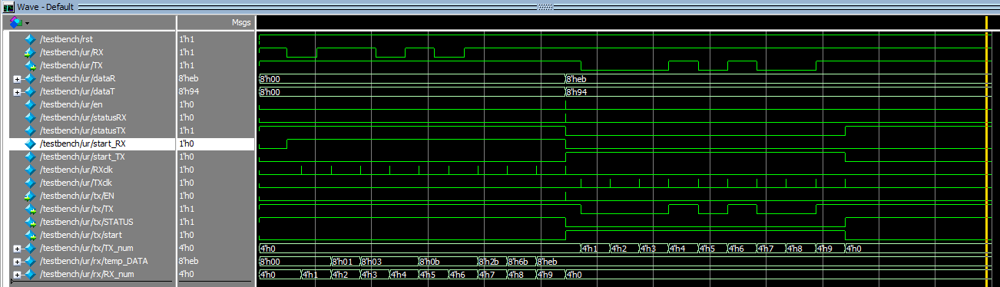

% UART 代码
% 庄永文 2013011208
% 2015.07

## UART 

### 实验目的

根据春季学期设计的 UART 实现一个 MIPS 的 UART 外设，波特率固定在9600，起始位 1 位，停止位 1 位，无校验位。

### 设计方案

UART模块分成UART发送、UART接收和波特率发生模块三部分组成。

* UART发送、接收模块
    - UART发送模块，包括clk, rst, EN, DATA 等输入，输出是发送数据TX, 状态STATUS, 和发送完成的标志END。内部有一个波特率发生模块，通过EN信号高电平脉冲激活波特率发生模块，产生9600Hz的脉冲，同时开始发送数据。发送数据结束时END信号产生一个高电平脉冲，同时STATUS恢复高电平空闲状态。 
    - UART接受模块，包括clk, rst, RX 等输入，输出是接收到的数据DATA, 接受状态STATUS。当RX变为低电平是启动波特率发生模块开始接受RX上传送的信息并依次存入DATA中，当接收完毕后STATUS产生一个高电平脉冲，表示UART接收结束。
* 波特率发生模块
    - 波特率发生模块包括clk, start, rst 等输入，输出是9600Hz的高电平脉冲。当start为高电平时开始计数，在计数达到每个周期中点的时候产生一个高电平脉冲，这样，在开始信号为高的时候就可以产生一个脉冲恰好在9600Hz的每个周期中点处，便于采样并减少误差。

### 关键代码

发送模块：

```verilog
wire clk_9600;         //发送时钟
BaudGen TXbg(.clk(clk),
    .clk_9600(clk_9600),
    .start(~STATUS),
    .rst(rst));
reg [3:0]TX_num;
reg [7:0]TX_DATA;
initial
begin
    TX<=1'b1;
    STATUS<=1;
    END<=0;
    TX_num<=4'h0;
end
always @(posedge clk or posedge rst) begin
    if (rst) begin
        // reset
        STATUS<=1;
        TX_DATA<=8'h00;
    end else if (EN) begin   //检测到EN信号
        TX_DATA<=DATA;
        STATUS<=0;
    end else if (TX_num==4'hA) begin
        STATUS<=1;
    end
end
always @(posedge clk or posedge rst) begin//发送数据
    if (rst) begin
        // reset
        TX<=1'b1;
        TX_num<=0;
        END<=1'b0;
    end
    //开始发送数据
    else if (clk_9600&&(~STATUS)) begin
        TX_num<=TX_num+4'h1;
        case(TX_num)
            4'h0: TX<=1'b0;         //起始位
            4'h1: TX<=TX_DATA[0];
            4'h2: TX<=TX_DATA[1];
            4'h3: TX<=TX_DATA[2];
            4'h4: TX<=TX_DATA[3];
            4'h5: TX<=TX_DATA[4];
            4'h6: TX<=TX_DATA[5];
            4'h7: TX<=TX_DATA[6];
            4'h8: begin
                TX<=TX_DATA[7];
                END<=1'b1;
            end
            4'h9: TX<=1'b1;
            default: ;
        endcase
    end
    else if (TX_num==4'hA) begin
        TX_num<=4'h0;
        TX<=1'b1;
    end
    else END<=0;
end
```

接受模块：

```verilog
wire clk_9600;          //中间采样点
reg start;              //接受RX时启动波特率发生器
reg [7:0]temp_DATA;
reg [3:0]RX_num;        //接受字节数
BaudGen RXbg(.clk(clk),
    .clk_9600(clk_9600),
    .start(start),
    .rst(rst));
always @(posedge clk or posedge rst) begin
    if (rst) begin
        // reset
        start<=1'b0;
    end
    else if (~RX) begin
        start<=1'b1;    //开启波特率发生器//开始接受
    end
    else if (RX_num==4'hA)begin
        start<=1'b0;    //关闭波特率发生器
    end
end
always @(posedge clk or posedge rst) begin
    if (rst) begin
        // reset
        STATUS<=0;
        DATA<=8'h00;
        temp_DATA<=8'h00;
        RX_num<=4'h0;
    end
    //开始接受数据
    else if (clk_9600&&start) begin
        RX_num<=RX_num+4'h1;
        case(RX_num)
            4'h1: temp_DATA[0] <= RX;
            4'h2: temp_DATA[1] <= RX;
            4'h3: temp_DATA[2] <= RX;
            4'h4: temp_DATA[3] <= RX;
            4'h5: temp_DATA[4] <= RX;
            4'h6: temp_DATA[5] <= RX;
            4'h7: temp_DATA[6] <= RX;
            4'h8: temp_DATA[7] <= RX;
            default: ;
        endcase
    end
    else if(RX_num==4'hA)begin
        RX_num<=0;
        STATUS<=1;
        DATA<=temp_DATA;
    end
    else STATUS<=0;
end
```

波特率发生模块产生9600Hz高电平脉冲

```verilog
// clk should be 27MHz
// start, rst, 高电平有效
// 产生9600Hz脉冲 
input rst;
input start;
input clk;
output reg clk_9600;
reg [15:0]state;
initial
begin
    clk_9600 <= 0;
    state <= 0;
end
always@(posedge clk or posedge rst) begin
    // Counter, period is 1/9600s
    if(rst) begin
        state<=0;
    end
    else if(state==2812 || !start) begin//2812
        state<=0;
    end
    else begin
        state<=state+16'd1;        
    end
end
always @(posedge clk or posedge rst) begin
    // generate 50%-duty 9600Hz clock, half the counter
    if (rst) begin
        clk_9600<=0;
    end
    else if (state==1406) begin//1406
        clk_9600<=1;
    end
    else begin
        clk_9600<=0;
    end
end
```


### 仿真结果及分析



最终仿真结果符合预期，在单周期与多周期处理器的应用中也没有出现过问题。

### 综合情况
* 状态机实现
    * 逻辑大小综合报告

        >Flow Status    Successful - Thu Jun 11 18:50:05 2015
        Quartus II Version  9.0 Build 132 02/25/2009 SJ Full Version
        Revision Name   UART
        Top-level Entity Name   UART
        Family  Cyclone II
        Device  EP2C35F672C6
        Timing Models   Final
        Met timing requirements N/A
        Total logic elements    107 / 33,216 ( < 1 % )
        Total combinational functions   101 / 33,216 ( < 1 % )
        Dedicated logic registers   69 / 33,216 ( < 1 % )
        Total registers 69
        Total pins  4 / 475 ( < 1 % )
        Total virtual pins  0
        Total memory bits   0 / 483,840 ( 0 % )
        Embedded Multiplier 9-bit elements  0 / 70 ( 0 % )
        Total PLLs  0 / 4 ( 0 % )

    * 时序性能
    使用TimeQuest Timing Analyzer
        > Fmax Summary:
        > Fmax=257.2MHz
        > Restricted Fmax=257.2MHz
        > Setup Slack = 16.112
        > Hold Slack = 0.391


### 硬件调试情况及体会

* 仿真通过后第一次烧到板子上后，发现每接受8个数据就会丢失一个数据，这是由于接受和发送数据之间的延时造成的。后来设法改掉延时后即可成功连续收发。
* UART的代码基本上就是串口收发器设计实验中的代码，只不过根据单周期处理器的时钟周期改变了一下波特率发生器。因此也体会到了代码复用的重要性，只要之前的串口收发器实验认认真真地做了，同时考虑了鲁棒性和稳定性，那么这次试验就会轻松很多。